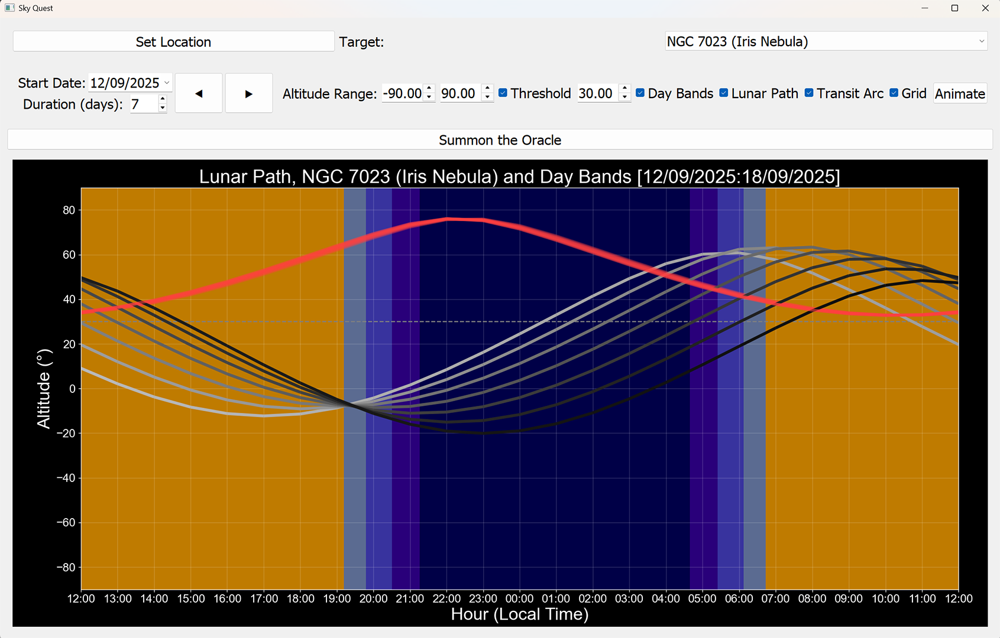
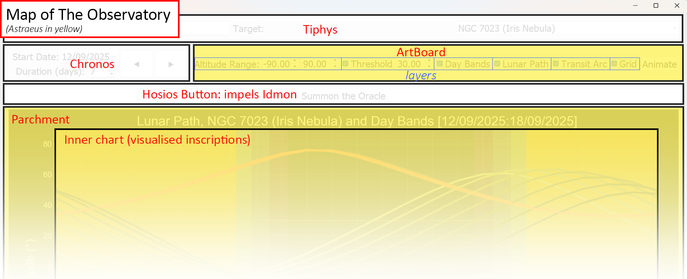

# SkyQuest

_(3, 0)world_:astrophotography.transits.world: This is the entry script fot the SkyQuest app.

SkyQuest shows the astronomical info regarding the observability of celestial bodies from a given earth-bound observation point;  you'll need to look elsewhere (perhaps out of the window) for metereological impact.

It provdes a 24-hour daily view of how selected bodies transit across the skyline from the chosen vantage point. Multiple daily views can be stacked. The x-axis shows the local time of day, sensitive to daylight saving time. When showing multiple days, the x-axis reflects the last day drawn. The y-axis sets the plotted altitude range.

Daylight bands can also be shown which segment the day (through coloured background blocks) between day and night, along with the various periods of twilight and dawn (civil, nautical and astronmical) - which is again true to the last day plotted.

Celestial bodies can be selected for the plot, with the lunar arc, also, always available. The lunar arc is plotted in grey, at a brightness dictated by the moon-illumination on each plotted hour. The transit arcs of chosen objects are plotted with a degree of transparency dictated by the moon-illumination - i.e indicating how visible such onjects _may_ be (of course that's also a question of altitude and weather)

It is therefore possible to see the optimum time to observe specific objects in the night sky with regards daylight level, moon-illumination and altitude - for one or more days; from anywhere in the world. The current dataset (from skyfield) is good to just before John Lennon's 113th birthday; so that'll need an update at some point...

Once a plot has been created, it can be animated. Basically this clears the chart and re-draws it on an hour-by-hour and day-by-day basis; optionally generating a video file. SkyQuest maintains 2 views on the data: that which renders the overall plot in its entirety, and; that which renders the plot as a sequenced animation. This supports fast visibility toggling of aspects of the plot (e.g. turning the lunar arc on or off), and also allows those aspects to be excluded from the (reccorded) animation. The animation can proceed either:

- To the full accccumulation of the plot, or

- as a sliding time window across the full day-range of the plot; e.g. to show a full monthly cycle changing across a year

SkyQuest is well aware of just what it IS. There are a number of founding principals woven inherently into the source-code. You might want to argue that I should have been more absract in my modelling, to make the code more (re)useful; I'd counter, you know, life is finite.  Anyways, so we are clear:

- SkyQuest shows a (possibly stacked) day-by-day view, with a 'day' being the 24h hour period that follows noon on a given date.

- Altitudes (and illumation) of objects are plotted to an hourly resolution.

- Events (sunrise, onset of astronomical twilight, etc...) are plotted to a minute resolution.

- There are 9 such events in a day

- Video is output in HD resolution at 50fps - i.e. at a rate of 2 full animated days per second.

In-code, SkyQuest is presented as a cast of ancient greek mythological figures and concepts. Time is presented as both its fundamental material (Chronos) and its working mechanics (Kairos) with some influence of the fates (Moirai) also. Tiphys (helmsman of the Argonauts) provides the navigational support by caring for our home base vantage and our destination (selected celestial bodies). Idmon (the Argonaut's seer) connects us with our almanacs (from skyfield). Astreus (a Greek god of astrology) visualises Idmon's prophecies, through a rich collection of artboard, inscription tools, and parchment.

_(296, 0)affordance_:astrophotography.transits.Observatory

On this quest everybody works within The Observatory.

It allows queries to be resolved on a day-by-day basis. Each of the attendants concentrate on a given day, as sequenced by the query presented.

Each of the key players provide their own control panels: vantage and targets from Tiphys; date and range from Chronos; Various plot settings from Astreus.  The observatory itself presents the master control (the hosios - attending the prophet Idmon - button).

_(385, 0)behaviour_:astrophotography.transits.main: Powers-up the observatory and allows it to run until explicitly stopped by the user exiting the main app by mouse or keyboard.

---

---

# Main Players

## Time and Destiny

_(2, 0)throughline_:astrophotography.aeonforge

Herein we steward time so that no-one else needs to worry about the vagueries of time management.

Just like the ancient greeks did, we split our concept of time into the material itself (how much of it we have to work with) and the mechanics of it (the expressions of time).

There are 2 key underlying concepts that are woven throughout:

- All days start at noon and last for exactly 24 hours. This places midnight at the center of our inquiries, since astronomers are implicitly night-owls. Also note, 24hrs from noon may or may not be noon on the following day, since we display local times along with the vagueries of daylight saving.

- Days are divided into, at most, 9 bands of daytime, night-time, dawns and dusks (civil, nautical, astronomical). Never more than 9 (the sun only rises once per day).

Note that we have imported QWidget from the continuum in its own (alien) metaphor. We allow that metaphor (of layouts, labels and fonts) to pervade here out of kindness to the sanity of others reading this module... but the underlying data concepts and exposures are within our chrono-mytho metaphor; as you will see.

_(15, 0)figuration_:astrophotography.aeonforge.Chronos

As the personification of time itself, Chronos sets the temporal limits of an inquiry.

_(140, 0)affordance_:astrophotography.aeonforge.Kairos

Regarding the nature of time, whilst Chronos concerns sequence, Kairos concerns moment.

Through the mechanics of Kairos we attain fundamental knowledge of moments such as 'what time is it, here'; 'what daylight band is it?'

One day Kairos will also understand the Vantage that Tiphys has set to better help us understand what time it is, although right now it always thinks we are in London!

---

## Place and Knowledge

_(39, 0)figuration_:astrophotography.transits.Tiphys

Tiphys was the Argonaut's navigator, and here takes care of location based concepts - i.e where we are and where we are going.

_(181, 0)figuration_:astrophotography.transits.Idmon

Idmon was a seer for the Argonauts, in fact he foresaw his own death on the voyage but went along anyway...

This quest is a little easier for him, he consults the almanacs to tell us where things are on a given hour. 

He always tracks the sun and the moon and informs us about the daylight, twilight and night-time bands for any given date; along with the moon-illumination at each hour of a given date.

Obvs, we also get the altitude data for observed objects on a (24) hourly basis for any given date.

He's kind of micro-managed, so if we want data for multiple days, or multiple target objects on a given date, he has to be re-consulted.

---

## Master Scribe

_(6, 0)throughline_:astrophotography.astraeus

There's quite a lot to do in terms of dislaying, animating and recording the plots that arise from the queries, so there are a number of layered concepts at play:

- ASTREUS is the master-scribe that orchestrates everything to do with the plot visualisation.

- He is equipped with an ARTBOARD (GUI) that allows visual elements to be turned on or of and provides:

- INSCRIPTION tools for adding elements to the plot; where each tool provides for the animation of the added inscriptions

- and whereby the inscriptions are laid down on a PARCHMENT for the final visualisation

---

---

---

# CHAPTER - Time and Destiny

## What we know

_(35, 8)knowledge_:astrophotography.aeonforge.Chronos.__init__.self.chronogenesis: the denoted start of time, allowing for the entry of a (niave) date

_(114, 4)knowledge_:astrophotography.aeonforge.Chronos.arche_date: the exact dawn of time (the first date)

_(99, 4)behaviour_:astrophotography.aeonforge.Chronos.arche_flux: A change in the chronogenesis implicitly invokes a new aion, a new quest

_(47, 8)knowledge_:astrophotography.aeonforge.Chronos.__init__.self.moira: the denoted destiny, the time alloted to us by the Fates (or Moirai) - as a simple integer

_(119, 4)knowledge_:astrophotography.aeonforge.Chronos.aion: our precise allotment of time

_(129, 4)behaviour_:astrophotography.aeonforge.Chronos.aion_flux: A change in our destiny, our alloted time.

_(124, 4)knowledge_:astrophotography.aeonforge.Chronos.eschatos: the end of days

_(77, 8)mechanism_:astrophotography.aeonforge.Chronos.__init__.self.telos: For the fulfillment of our destiny. The quest itself is governed by The Observatory, which provides it (via callaback) to Chronos so that time-flux based impulses can be satisifed.

_(151, 4)knowledge_:astrophotography.aeonforge.Kairos.day_bands: meaning of oblique twilight band codes (as revealed by Idmon) - note that twilight covers both ends of the day (dawn and dusk)

_(148, 4)knowledge_:astrophotography.aeonforge.Kairos.local_tz: reference for local time

_(106, 4)impulse_:astrophotography.aeonforge.Chronos._quest: Although we never directly see our destiny (it is elsewhere written in the stars) we can still reach it through quest; which is triggered by any change in time, or by The Observatory when a new query is presented.

---

## Mechanics

_(168, 4)mechanism_:astrophotography.aeonforge.Kairos.divine_universal_time: provides the universal time for a given offset from noon of a given date.

We work from noon because midnight is always at the center of our focus.

_(212, 4)mechanism_:astrophotography.aeonforge.Kairos.to_utc: Convert any (not niave) time to UTC, allowing for daylight saving

(can also check that a time **is** UTC)

_(180, 4)mechanism_:astrophotography.aeonforge.Kairos.true_hour: provides the universal time for a given hour after noon on a given date

Allows us to be agnostic to timezones and daylight saving concerns

Slightly blunt since we only allow for hour-resolution, but that is all we ever use.

_(202, 4)mechanism_:astrophotography.aeonforge.Kairos.utc_hours_difference: Finds the (fractional) hours separation between two UTC times

_(190, 4)mechanism_:astrophotography.aeonforge.Kairos.what_time_is_it: Tells us what time it is at a given time!

We can never really know what time it really is... because of daylight saving!

So this answers the question, what time is it 'x' hours after noon on 'date', where we are asking from.

_(91, 8)impulse_:astrophotography.aeonforge.Chronos.__init__.self.chronogenesis.dateChanged.connect: If a new aion begins then we  we attempt to fulfill our destiny through quest

_(86, 8)impulse_:astrophotography.aeonforge.Chronos.__init__.self.moira.valueChanged.connect: If something changes our destiny (our alloted time) we attempt to fulfill it through quest

---

---

# CHAPTER - Divinations

_(203, 4)behaviour_:astrophotography.transits.Idmon.set_transit: Does the heavy-lifting needed to consult the almanac for a number of things on a given date. This takes account of the fact that the vantage point shifts (with respect to the heavens) over the course of a day due to the earth's rotation. 

Note that because the lunar arc is always available to the plot, **and** because we use the moon-illumination when plotting other arcs, Idmon provides those as soon as the heavy-lifting has been achieved.

_(64, 8)knowledge_:astrophotography.transits.Tiphys.__init__.self.targets: Right now we have small, hand curated, list of celestial references. Really, this ought  to get loaded from a JSON file, with some kind of tool to support maintaing that by navigating the options within our almanac.

_(118, 4)mechanism_:astrophotography.transits.Tiphys.destination: gives us a list of dicts of the things we want to observe. These things may either be planets (with their skyfield-internal id) or objects designated by ra/dec values.

Tiphys is a little surly in these regards, currently lettting us choose either all the planets, or **a** planet or single object. However, he supplies the info as a list, so with a little further care, we could provide for much richer queries.

_(107, 4)knowledge_:astrophotography.transits.Tiphys.vantage: From where we are looking

_(150, 4)mechanism_:astrophotography.transits.Tiphys.HomeBase: Although ancient, Tiphys is fully up-to-date with GDPR type concerns. The vantage (home location) is hidden behind a buttton so it isn't captured by any screen grabs.

This could be quite lovely if it were to open a map-picker interface

_(191, 8)knowledge_:astrophotography.transits.Idmon.__init__.self.loader: this retrieves the almanac, which must have been downloaded

_(235, 4)mechanism_:astrophotography.transits.Idmon.get_transit_arc: Provides the altitude of a given target at each hour of the transit date; handles both planetary and star type targets.

_(254, 4)mechanism_:astrophotography.transits.Idmon.get_twilight_bands: Works out the daily event times, e.g. sunrise et al. on the transit date

provides a list of (9) start/end times-of-day periods consulting Kairos to prescribe the type of the time-period (day, night, etc...)

Whilst it doesn't attemt to differentiate between dusks and dawns that is to our advantage because neither do we! All that matters to us is the daylight level: true night, astronomical twilight, nautical twilght, etc.. whichever end of the day we find those levels.

Logically speaking we get 9 of these per day. We can cope with fewer (like we might see near the poles) but we have a deeply grounded faith that no day (24 hour period) will see the sun rise twice. I think that's reasonable.

---

---

# CHAPTER - Charting

_(15, 0)figuration_:astrophotography.astraeus.Astraeus

Astraeus derives from the Greek word for 'star' and is said to be the father of the winds - so very much a key player in any astronomical quest.

In this quest he creates the charts that answer the queries presented in The Observatory, which calls for the presentation to be started/completed - and for the days of interest to be drawn-in.

_(4, 0)throughline_:astrophotography.artboard

The ArtBoard is essentially a collection of inscription tools along with a scroll (of PARCHMENT).

_(2, 0)throughline_:astrophotography.inscriptions

Inscriptions are chart elements that:

- contain a 'veil', a collection of marks on the parchment

- provide (UI) tooling to draw or hide the veil (or otherwise effect its apppearance)

- maintains the animation sequence for the veil's marks

- provides the means to execute the animation sequence

_(2, 0)throughline_:astrophotography.parchment

The Parchment is where we actually (finally!) get to see stuff. It is powered by (and totally encapsulates our use of) matplotlib.

It contains those visible elements that are not a part of the SkyQuest query per se - i.e. the chart title and axis.

It allows for fresh parchments to be laid down, and old parchments to be recalled as we create new queries, or switch between displaying charts and animating charts.

 

The parchment is supported by further affordances that handle our ability to restore old parhcments, and also for the actual mark-making.

---

## The ArtBoard

_(26, 0)affordance_:astrophotography.artboard.ArtBoard

The ArtBoard controls presentation layers - whether or not we want to see groups of things, and what we want them to look like.

So, for example, we can turn the display of the lunar arc on or off; or we can set the range of altitudes we want to see.

One day we will extend this to allow selection of ink colours for the plotted arcs.

The ArtBoard also lets us kick-off the animated reveal of the chart, providing us with the tools to control that.

The ArtBoard comprises sets of layers that can be toggled on or off, with each layer being provisioned the inscription tools needed to draw the layer.

### Inscription Tool Types

_(112, 4)mechanism_:astrophotography.artboard.ArtBoard.InscribeArc: Extends the basic inscription tool so that (complex) arcs can be inscribed.

This tool adds one inscription for each arc to be displayed; we may have several arcs each day (e.g. all the planets) or we may end up with an arc for each of several days.

We create one such tool for each set of arcs we provide - i.e. 2 such tools: the lunar arcs and, the transit arcs.

_(127, 4)mechanism_:astrophotography.artboard.ArtBoard.InscribeBackground: Extends the basic inscription tool so that backgrounds can be inscribed.

This is slightly different to inscribing arcs because we have one background - we don't accumulate the background day by day; rather we shift what is already there. Thus, you will note that the actual inscriptions are generated statically and then **modified** - rather than adding new inscriptions as we progress

_(195, 4)mechanism_:astrophotography.artboard.ArtBoard.InscribeGrid: Extends the basic inscription tool so that we can control the parchment's grid display. Again, we never add further inscriptions to this tool (there is only 1 grid), and the grid itself is not animated.

_(159, 4)mechanism_:astrophotography.artboard.ArtBoard.InscribeThreshold: Extends the basic inscription tool so that a value can be accepted that inscribes a horizontal guide on the parchment. 

We only allow for one guide, so the inscription is created statically when we forge the tool and is updated (via the UI) when desired. It is not an animated inscription.

### ArtBoard Layers

_(9, 0)affordance_:astrophotography.artboard.Layer

The Inscription tools have an associated 'layer' which provides the UI elements of the tool. 

A basic layer provides a simple toggle that connects to the inscriptions's visibility control

_(172, 8)affordance_:astrophotography.artboard.ArtBoard.InscribeThreshold.ThresholdLayer

Extends a basic layer by also providing UI for a threshold value

_(69, 4)affordance_:astrophotography.artboard.ArtBoard.AltitudeRange

Extends a basic layer by also providing for a pair of values which are directly connected to the parchment's Y-axis

### Supporting mechanisms

_(288, 4)mechanism_:astrophotography.artboard.ArtBoard.render_title: Renders a title for the plot taking account of what is actually plotted (visible). 

Note that a reference to this method is provided to the inscriptions that effect the title - so the title is re-rendered when such inscriptions are turned on or off.

_(275, 4)mechanism_:astrophotography.artboard.ArtBoard.wipe: Cleans-up the ArtBoard when we are ready to start plotting a new presentation

_(215, 4)mechanism_:astrophotography.artboard.ArtBoard.__init__: Creates an ArtBoard with all of its complex tooling.

-  a provided scroll is pinned to the artboard

- It's part of the ArtBoard's duty to keep track of which day we're dealing with when we are plotting over multiple days. 
- UI components are added for the plot itself (the scroll PARCHMENT)
- and for the animation utility
- Specialised inscription tooling is added for the threshold indicator, the background, and the grid
- then the inscription tooling and UI controls for each of the transit arcs are added. To keep the UI light the inscriptions are grouped into sets, with a UI control for each set: Background, Lunar arc, all (other) transit arcs

---

## Inscriptions

_(11, 0)affordance_:astrophotography.inscriptions.Inscriptions

Inscriptions add 'stuff' to the presentation which can then be shown on the parchment. either as a complete charted element, or as an animated sequencce.

They work with the PARCHMENT to make this stuff visible, but the main concern of an inscription is to granularise the inscribed 'thing' so that it can be revealed step-by-step when an animation is requested.

The main affordance describes what an inscription IS and provides the main animation logic

### Inscribing

_(20, 4)affordance_:astrophotography.inscriptions.Inscriptions.Inscribe

Inscriptions are sets of marks that can be made on a parchment.

The full set lives in the 'veil' which may or may not be drawn at any given point (determined by the inscription's visible state)

That's all there is to it for simple inscriptions like the grid or the guides.

More complex (or compound) inscriptions like transit arcs and the background are also created as animateable groups - i.e. per-hour per-day segments. Unlike the veil (which is completely on or off) these can be revealed step-by-step (when we animate). 

Effectively the inscriptions provides 2 views on the same displayable 'thing': the entire thing (line or background) turned on or off as a whole, and; a segmented version turned on or off on an hour-by-hour basis.

_(39, 8)mechanism_:astrophotography.inscriptions.Inscriptions.Inscribe.add_inscription: Adds a set of marks to the inscription's veil (the overall view of the chart)

_(47, 8)mechanism_:astrophotography.inscriptions.Inscriptions.Inscribe.update_inscription: Updates previous inscriptions, but only in a simple well-defined way; i.e. when we know exactly what we are dealing with. So we may change the value of an existing guideline, or the extent of a known background band.

_(149, 8)skill_:astrophotography.inscriptions.Inscriptions.Inscribe.draw_veil: Directs the parchment to make or erase the marks of this veil (i.e avoids direct low-level calls into matplotlib at this point)

_(54, 8)mechanism_:astrophotography.inscriptions.Inscriptions.Inscribe.make_arc_inscription: Adds segemented lines to the animation view, returning an inscription set that can then also be added to the veil - i.e. presumes the data is already suitably segmented (by the hour), which it will be when it comes to transit arcs that are derived on an hourly basis.

_(84, 8)mechanism_:astrophotography.inscriptions.Inscriptions.Inscribe.make_bg_inscription: Creates the animation steps for the background. These either grow the day bands from nothing to full width (day zero) or else shuffles the boundary between the day bands (on subsequent days).

Note that the inscriptions themselves are already added, here we create the animation steps that adjust them.

_(130, 8)mechanism_:astrophotography.inscriptions.Inscriptions.Inscribe.set_visibility: Shows or hides the inscription's veil, updating the overall plot title if needed

_(142, 8)mechanism_:astrophotography.inscriptions.Inscriptions.Inscribe.toggle_visibility: For the UI which operates in terms of toggle rather than absolute state

---

## Parchment

_(254, 0)affordance_:astrophotography.parchment.Parchment

The parchment sets the overall look and feel of a chart, it orchestrates the ChartedElements and provides for video records. It is the visualisation of the chart.

### Save and Restore

_(376, 4)mechanism_:astrophotography.parchment.Parchment.fresh_parchment: Saves the format and content of the current parchment, before clearing it for fresh duty.

Changes the parchment format if we are writing a video file (to HD geometry)

_(417, 4)mechanism_:astrophotography.parchment.Parchment.restore_parchment: Signs-off the current parchment (closing the video file if we had it open) before clearing and restoring whatever went before.

_(400, 4)mechanism_:astrophotography.parchment.Parchment.clear_plots: Clears any existing chart content that a new query will influence.

I.e. remove line collectioons and super-slim background blocks (to a width of 0)

_(11, 0)affordance_:astrophotography.parchment.ChartedElements

Simply stores or recalls all elements of a chart - lets us restore the parchment if we wipe it in order to present the animated version; manages both content and format.

_(23, 4)mechanism_:astrophotography.parchment.ChartedElements.save_geometry: Saves the format (geometry) of the parchment, in case we need to change it for video output

_(31, 4)mechanism_:astrophotography.parchment.ChartedElements.restore_geometry: Restores the format (geometry) of the parchment

_(40, 4)mechanism_:astrophotography.parchment.ChartedElements.save_original_ax: Saves the chart content in case we need to clear the parchment for the animation

This includes:

- the line collections of the transit arcs, which get removed so they can be added piece-by-piece in the animation

- the visible extent of the background daybands, which don't get removed but do get resized by the animation

- x-axis ticks, which might be blanked at the end of an animation

- the chart title. To be honest this ought to be right when an animation ends, but it will have been twiddled with so might as well save the original along with the foregoing

_(65, 4)mechanism_:astrophotography.parchment.ChartedElements.restore_original_ax: Simply reverses the original save

---

### Making Marks

_(81, 0)affordance_:astrophotography.parchment.InnerChartElements

By 'inner' we mean the actual plot area of the chart, so that's the data we plot, the background elements, any guide lines and the grid. 

Lets us add/change/remove and show/hide such elements.

_(107, 4)skill_:astrophotography.parchment.InnerChartElements.inscription_visibility: Turns all marks of an inscription on or off

#### For Transit Arcs

_(128, 4)mechanism_:astrophotography.parchment.InnerChartElements.add_lines: Adds the lines of a transit arc as a line collection.

For the main plot this will be many segments of a full-day arc.

During animation, this will be the first hour's segments only

_(166, 4)mechanism_:astrophotography.parchment.InnerChartElements.decay_line: Shrinks a line collection from its earliest point, until it is sooo short it is no longer a collection of lines (whereupon it is removed completely)!

_(142, 4)mechanism_:astrophotography.parchment.InnerChartElements.extend_line: Specifically for the animation, extends an arc's previous line collection with a new hour's segment

#### For the background

_(185, 4)mechanism_:astrophotography.parchment.InnerChartElements.add_block: Adds a block (rectangle) to the parchment

_(203, 4)skill_:astrophotography.parchment.InnerChartElements.set_block: Updates the position and extent of a block on the parchment

_(212, 4)mechanism_:astrophotography.parchment.InnerChartElements.shuffle_blocks: Shuffles blocks: i.e. shifts the end point of one block and the start point of its (right-hand) neighbour; juggling the widths as needed. This lets us see the bands grown and shrink as the days pass by.

_(230, 4)mechanism_:astrophotography.parchment.InnerChartElements.decay_blocks: Shrinks background blocks from the left, specifically during the wind-down of an animation

#### Ancilliaries

_(90, 4)mechanism_:astrophotography.parchment.InnerChartElements.hguide: Inscribe a horizontal guide on the parchment, or modify its position if it has already been inscribed.

_(116, 4)mechanism_:astrophotography.parchment.InnerChartElements.set_grid: Establish the look of the grid (when it is visible) or else sets the grid invisaible

_(293, 4)affordance_:astrophotography.parchment.Parchment.XAxis

Presents the x-axis and handles changes to its tick labels

_(265, 4)affordance_:astrophotography.parchment.Parchment.YAxis

Presents the y-axis and handles changes to its range

_(369, 4)skill_:astrophotography.parchment.Parchment.retitle: Renders a new title for the chart

_(432, 4)skill_:astrophotography.parchment.Parchment.redraw: Ensures everything actually gets rendered.

---

## Plots

_(339, 4)behaviour_:astrophotography.transits.Observatory.present_query: THIS is the telos, the fulfillment of our destiny. 

Sets up the specific observation requested then steps through the day range to marshal the skills of Idmon and Astraeus to build-up the results.

Finally calling on Astraeus to complete the works and present the plot

_(45, 4)mechanism_:astrophotography.astraeus.Astraeus.commence_presentation: Sets-up the ArtBoard with a fresh parchment for the new plot (clearing any animation)

_(58, 4)behaviour_:astrophotography.astraeus.Astraeus.draw_day: Draws the entire plot for a single day: the background day bands, each transit arc, the title and the axes.

The title includes the (overall) day range and so needs updating for each plotted day, as does the x-axis as the time-of-day hour labels change when we have daylight saving.

_(118, 4)mechanism_:astrophotography.astraeus.Astraeus.draw_day_bands: Adds the day/twilight colour-bands to the inscriptions

_(133, 4)mechanism_:astrophotography.astraeus.Astraeus.plot_arc_day: Adds (all) the transit arcs to the inscriptions for a given day

_(160, 4)mechanism_:astrophotography.astraeus.Astraeus.complete_presentation: Finalises a presentation by adding the threshold inscription and calling on the ArtBoard's draw_veil methods to set what is (or isn't) visible. Thereafter calling on the parchment to do the draw.

_(27, 8)knowledge_:astrophotography.astraeus.Astraeus.__init__.arc_sets: we always allow for the lunar arc, plus 1 or more celsatial bodies

_(22, 8)knowledge_:astrophotography.astraeus.Astraeus.__init__.self.greyscale: a look-up table that lets us plot the moon's arc relative to its illumination

_(34, 8)knowledge_:astrophotography.astraeus.Astraeus.__init__.self.target_colours: the colours we use to plot celestial arcs. Fixed here but one will be managed by the ArtBoard

---

---

## Animations

_(333, 4)behaviour_:astrophotography.artboard.ArtBoard.do_animation: Initiates an animation, allowing a video render to be produced also.

_(38, 4)mechanism_:astrophotography.artboard.ArtBoard.AnimationModeDialog: Allows us to direct how the animation of a plot procedes - i.e. should each day accumulate in the plot, or should older days be erased as the animation procedes.

_(368, 0)affordance_:astrophotography.artboard.AnimationFilter

Records the state of the chart display before we start messing with it in order to present the animation; resetting the initial state when the animation completes.

Having remembered the original state of the chart display it can also answer the question 'is this part of the animation'? whilst the animation is running; So only those thongs visible when we asked for the animation are included in the animation.

_(252, 4)behaviour_:astrophotography.inscriptions.Inscriptions.animate: Executes the animation of the current (complete) plot.

-  Remember what was visible before the animation so we can restore that state later. Then turn all the veils of so we have a blank slate for the animation to begin.

- animate by day...
- ... by hour...
- ...by step...
- only animate that which was visible
- remove any expired line segments / collections
- if we are currently unwinding the animation, just get on with it, no need to look for any steps that might want adding
- otherwise perform the animated steps, which includes:
    - update title (specifically so the date range is accurate)
    - update x-axis ticks, which change on daylight saving days
    - add the transit arcs for the hour
    - grow the day bands as the animation procedes. So on day 1 we see the daybands expand from nothing
    - shuffle the day bands on subsequent days
- At the end of each hour now...
- on the final day of the unwind, erase the background and the x-tick labels (since time is evapourating..!) on an hour-by-hour basis
- display/record the animation of this hour
- at the end of day, step to the next day, if there is one

_(164, 4)affordance_:astrophotography.inscriptions.Inscriptions.DayTracker

Keeps track of the days during an animation, providing the key mechanisms for a controlled unwind at the end of the animated day range (if needed)

_(188, 8)disposition_:astrophotography.inscriptions.Inscriptions.DayTracker.more_days: A simple yes or no to the question 'are there more days to present': whether those days are the main animation, or days in the unwind period.

_(177, 8)mechanism_:astrophotography.inscriptions.Inscriptions.DayTracker.step_day: Keeps track of days both through the day-range of the animation, and through the unwind period atthe end off an animation

_(196, 8)disposition_:astrophotography.inscriptions.Inscriptions.DayTracker.too_many_days: Indicates if we ought to be erasing earlier arcs from teh plot as the animation procedes.

_(204, 8)disposition_:astrophotography.inscriptions.Inscriptions.DayTracker.final_day: Indicates if this is the final day of the end of days

_(212, 4)affordance_:astrophotography.inscriptions.Inscriptions.ArcLimiter

An intermediary between the animator and the PARCHMENT.

Collects references to the marks that are made so they can be progressively removed later if required.

_(226, 8)mechanism_:astrophotography.inscriptions.Inscriptions.ArcLimiter.expire: Removes all of the marks made in the (current) oldest hour of the animated chart

_(238, 8)mechanism_:astrophotography.inscriptions.Inscriptions.ArcLimiter.extend: Adds the animated marks to the PARCHMENT, remembering all the marks made in the given hour so they can later be expired.

---

---

# APPENDIX: CONTINUUM

_(2, 0)throughline_:astrophotography.continuum

Defines foundational imports and truths upon which the drama unfolds.

All our modules perform 'import *' from the continuum.

In a larger app we would split this into separate modules, and then use __init__.py to 'import *' from the core section only, with individual user modules then importing all from the extensions.

but it is kept simple for now, albeit less scalable.

NOTE:: This is THE CONTINUUM, it only hosts the external world and NEVER includes imports of app-local modules!

I know, its unusual to promote the use of 'import *' (and you may well hate the idea) but exactly what gets imported is somewhat restricted to exactly what we use and this appproach gives us a single point of truth with regards our reliance on the wider world..!

## Standards

_(17, 0)continuum_:astrophotography.continuum.sys: we use the standard sys module to get CLI arguments and issue exit codes.

_(27, 0)continuum_:astrophotography.continuum.collections: we use the convenience of the defaultdict to ensure we can always index every hour of every day in a given day range, since conceptually those indices are always valid (days always have 24 hours!) - even if we don't happen to have any data for a given time.

_(23, 0)continuum_:astrophotography.continuum.math: The standard math module provides 'ceil', which helps to chunk time into 1 hour bands

_(25, 0)continuum_:astrophotography.continuum.numpy: The NUMPY module is used a convenience to create small sequences, when needed - there no serious vectorised operations in this app

_(19, 0)continuum_:astrophotography.continuum.gc: at the end of an animation we have a lot of matplotlib objects to clean-up, at which point we perform an explicit garbage collection. Not really something we should HAVE to do, but, well - matplotlib...

_(21, 0)continuum_:astrophotography.continuum.time: The standard time module provides 'sleep', for when we want to pace an interactive animation

_(31, 0)continuum_:astrophotography.continuum.datetime: Dates and times pervade in this application, but you can pretty much always expect them to be standard datetime objects - EXCEPT where Idmon needs to work in Julian dates, but that's a complexity he keeps to himselff...

_(36, 0)continuum_:astrophotography.continuum.zoneinfo: when we add contextual time to a (naive) input date we do so as UTC, then convert to local time as needed (e.g. when display time axes); in general we can expect our datetime objects to be UTC

---

## Sources

_(42, 0)continuum_:astrophotography.continuum.skyfield.api: All of our astronomical knowledge is drawn from skyfield, based on data downloads in './skyfield-data'

---

## UI

_(56, 0)continuum_:astrophotography.continuum.PyQt5.QtWidgets: All GUI  is provided by PyQt5

---

## Plotting

_(102, 0)continuum_:astrophotography.continuum.matplotlib.animation: provides the (FFMPEG) video writer

_(96, 0)continuum_:astrophotography.continuum.matplotlib.backends.backend_agg: provides the chart visualisation when recording video frames

_(92, 0)continuum_:astrophotography.continuum.matplotlib.backends.backend_qt5agg: provides the interactive (on-screen) chart visualisation, in concert with GUI (PyQt5)

_(111, 0)continuum_:astrophotography.continuum.matplotlib.collections: All of our actual plotted arcs are created as line collections, which helps when we want to animate the chart

_(123, 0)continuum_:astrophotography.continuum.matplotlib.colors: we use colours with transparency when plotting the transit arcs, inversely relative to the moon illumination (which makes celestial objects less visible!).

_(107, 0)continuum_:astrophotography.continuum.matplotlib.figure: lets us add figures to a canvas - we only ever work with 1 figure, but nevertheless matplot lib treats a canvas as containing a set of figures.

_(119, 0)continuum_:astrophotography.continuum.matplotlib.font_manager: we use a single font family, but at a variety of sizes

_(115, 0)continuum_:astrophotography.continuum.matplotlib.patches: the background visualisation of daylight/twilight bands is achieved by adding rectangles (behind the transit arcs) as so-called patches.

_(104, 0)continuum_:astrophotography.continuum.matplotlib.pyplot: only required when we come to release canvas memory

